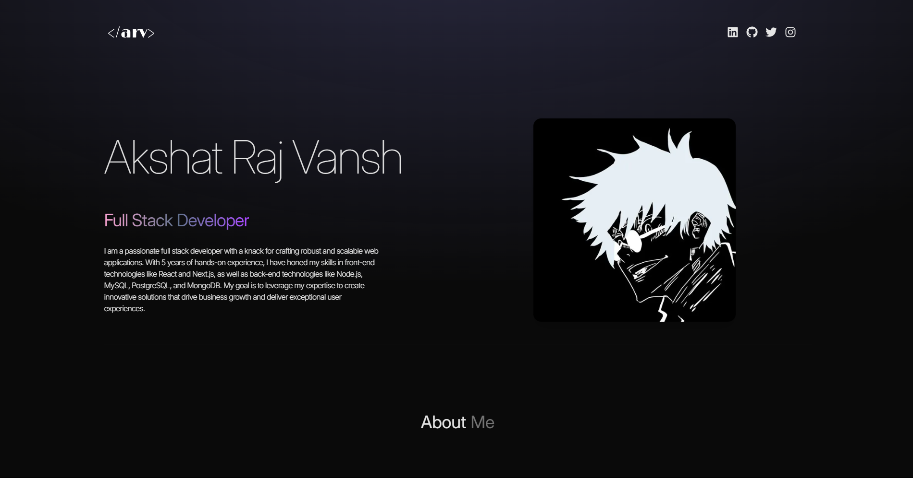

# 🚀 [Akshat Raj Vansh]'s Portfolio

  
*A modern, responsive portfolio built with React and Tailwind CSS.*

## 🔥 Features
- **Responsive Design** - Works on mobile, tablet, and desktop.
- **Dark/Light Mode** - Toggle between themes (optional, if implemented).
- **Project Showcase** - Highlight your best work with descriptions and links.
- **Skills Section** - Display your tech stack with icons.
- **Contact Form** - Easy way for visitors to reach you (if included).

## 🛠️ Technologies Used
- ⚛️ **React** (Vite/CRA)  
- 🎨 **Tailwind CSS** (Styling)  
- 📦 **Framer Motion** (Animations - optional)  
- 📝 **React Icons** (For skill icons)  
- 🌍 **React Router** (If multi-page)  

## 🚀 Live Demo
👉 **[View Portfolio](https://rajvanshakshat.netlify.app/)**
